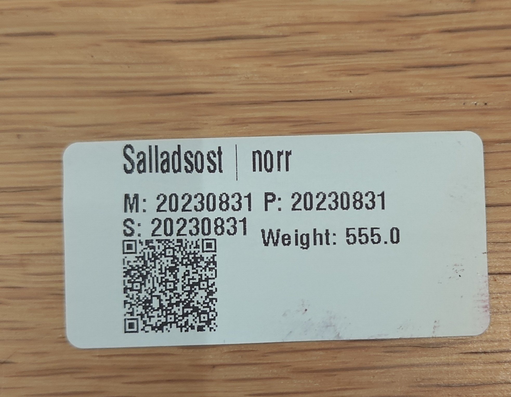

# zebracontrol
Appdaemon app for Home Assistant  that connects to a CUPS Zebra ZPL2 label printer

1. Setup CUPS on the computer connected to the Zebra printer
2. Add packages zebra and zpl to the AppDaemon configuration
3. Create the helpers specified in apps.yaml
4. Modify zebraControl.py to your own needs
5. Create a dashboard for your stuff
6. Print for your life

