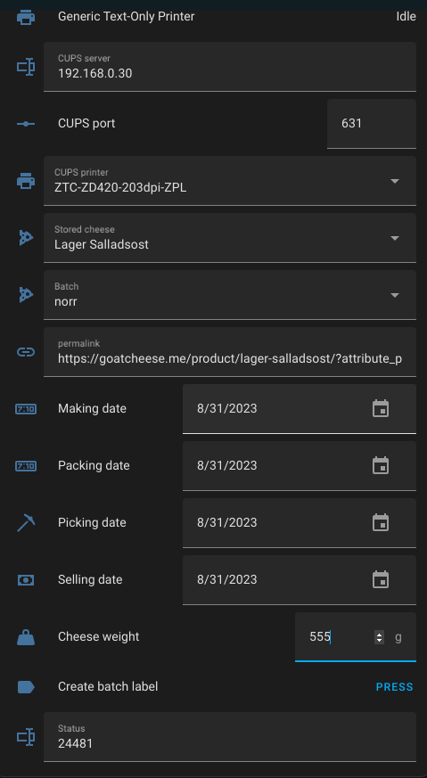

# zebracontrol
Appdaemon app for Home Assistant  that connects to a CUPS Zebra ZPL2 label printer

1. Setup CUPS on the computer connected to the Zebra printer
2. Install the AppDaemon Home Assistant Add-on according to your setup: https://appdaemon.readthedocs.io/en/latest/
3. Add packages zebra and zpl to the AppDaemon configuration
4. Create the helpers specified in apps.yaml
5. Put zebracontrol.py in /config/appdaemon/apps
6. Modify zebracontrol.py to your own needs
7. Create a dashboard with your helpers
8. Print for your life

